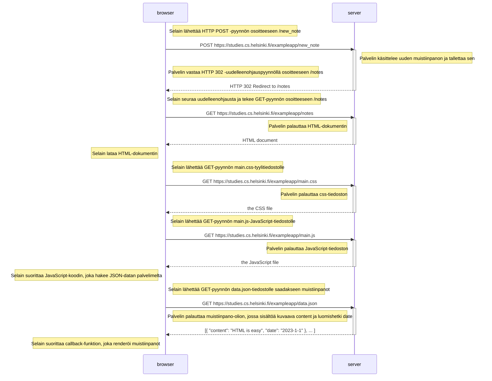

# Uuden muistiinpanon luominen - sekvenssikaavio

Kun käyttäjä luo uuden muistiinpanon kirjoittamalla tekstikenttään ja painamalla "Tallenna"-nappia sivulla https://studies.cs.helsinki.fi/exampleapp/notes, tapahtuu seuraava tapahtumasarja:

