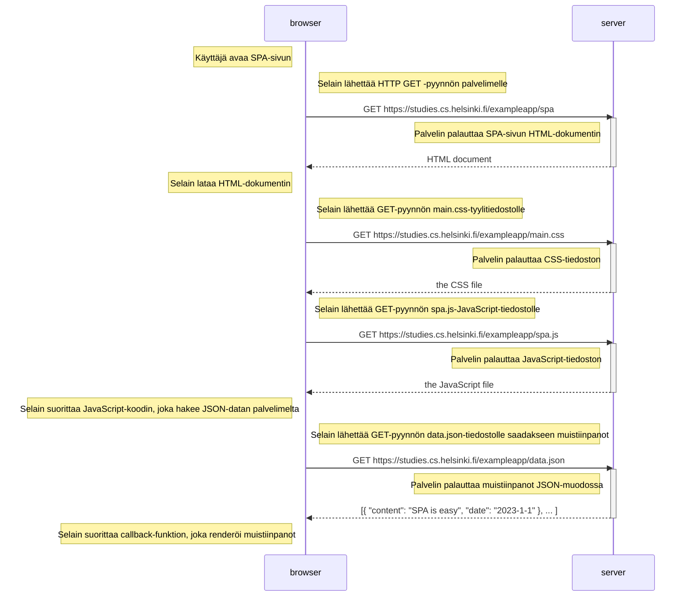

# Single Page App

## Sekvenssikaavio käyttäjän siirtymisestä sivulle https://studies.cs.helsinki.fi/exampleapp/spa

Kun käyttäjä menee selaimella osoitteeseen https://studies.cs.helsinki.fi/exampleapp/spa, tapahtuu seuraava tapahtumasarja:

