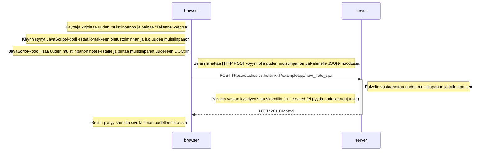

#  Single Page App / Uuden muistiinpanon luominen - sekvenssikaavio

## Sekvenssikaavio käyttäjän luodessa uuden muistiinpanon Single Page App -versiossa

Kun käyttäjä luo uuden muistiinpanon Single Page App -versiossa kirjoittamalla tekstikenttään ja painamalla "Tallenna"-nappia sivulla https://studies.cs.helsinki.fi/exampleapp/spa, tapahtuu seuraava tapahtumasarja:

